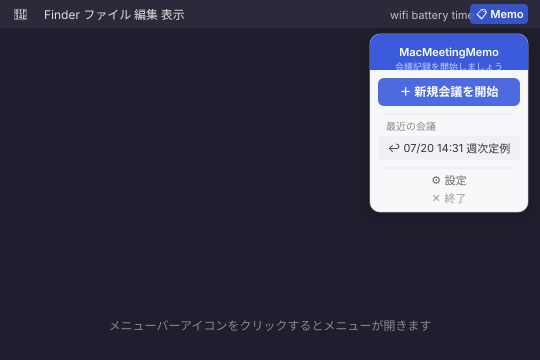
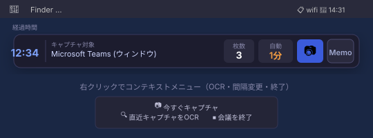
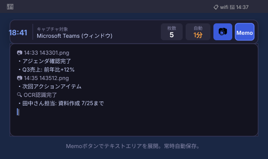
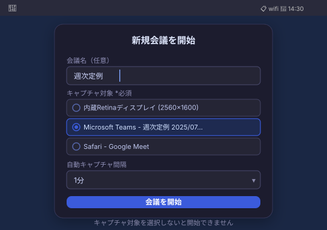

# MacMeetingMemo

[](https://github.com/umekenn/MacMeetingMemo)
[](https://swift.org)
[](LICENSE)
[](https://github.com/umekenn/MacMeetingMemo/releases/latest)

会議中のスクリーンショットとテキストメモを、軽量に記録する macOS ネイティブアプリ。

Apple Silicon Mac 向けに最適化されたシンプルな会議記録ツールです。Dock に表示せずメニューバーに常駐し、会議中はフローティングバーを画面最前面に固定して記録を続けます。

---

## ⬇️ ダウンロード

**[MacMeetingMemo-v1.0.0.zip](https://github.com/umekenn/MacMeetingMemo/releases/latest/download/MacMeetingMemo-v1.0.0.zip)** をダウンロードして zip を解凍し、`MacMeetingMemo.app` を `/Applications` にコピーするだけで使えます。

> **初回起動時の注意**  
> macOS のセキュリティ確認が出た場合は、Finder で右クリック → 「開く」を選択してください。  
> また、キャプチャ機能には「画面収録の許可」が必要です。  
> `システム設定 > プライバシーとセキュリティ > 画面収録` で `MacMeetingMemo` を許可 → アプリ再起動。

---

## 📸 画面イメージ

### 1. メニューバーから操作



メニューバーの **📋 Memo** アイコンをクリックするとメニューが開きます。新規会議の開始、直近の会議の再開、設定への移動が可能です。

---

### 2. フローティングコントロールバー



会議中は幅 500px / 高さ 48px の小型ウィンドウが画面最前面に常時表示されます。  
左から **経過時間 / キャプチャ対象 / 枚数 / 自動間隔 / 📷ボタン / Memoボタン** が並びます。  
**右クリック**でコンテキストメニュー（即時キャプチャ・OCR・間隔変更・会議終了）が開きます。

---

### 3. テキストメモの入力



**Memo ボタン**でコントロールバー直下にテキストエリアが展開します。  
キャプチャのたびに `📷 HH:mm filename` マーカーが自動挿入され、日本語・英語入力に対応しています。常時自動保存のため、保存操作は不要です。

---

### 4. 新規会議の開始



会議名・キャプチャ対象・自動キャプチャ間隔を設定して開始します。  
**キャプチャ対象は必須選択**です。Teams・Zoom・ブラウザなど任意のウィンドウをウィンドウ単位で選択できます。

---

## 🚀 使い方

### ステップ 1 — アプリを起動する

`MacMeetingMemo.app` を起動するとメニューバーに **📋 Memo** アイコンが表示されます（Dock には表示されません）。

### ステップ 2 — 会議を開始する

1. メニューバーの **📋 Memo** をクリック
2. **＋ 新規会議を開始** を選択
3. **会議名**（任意）を入力
4. **キャプチャ対象**を選択（Teams・Zoom・Safari など任意のウィンドウ、またはディスプレイ全体）
5. **自動キャプチャ間隔**を設定（OFF / 30秒 / 1分 / 5分）
6. **会議を開始** をクリック

→ フローティングコントロールバーが画面最前面に表示され、記録が始まります。

### ステップ 3 — 会議中の操作

| 操作 | 方法 |
|------|------|
| 手動スクリーンショット | コントロールバーの **📷** ボタンを押す |
| テキストメモを入力 | **Memo** ボタンを押してテキストエリアを開き、そのまま入力 |
| OCR（文字起こし） | コントロールバーを右クリック → **直近キャプチャをOCR** |
| 自動キャプチャ間隔を変更 | 右クリック → **自動キャプチャ間隔を変更** |
| 会議を終了 | 右クリック → **会議を終了** |

### ステップ 4 — 出力ファイルを確認する

会議終了後、保存先フォルダ（デフォルト: `~/Documents/MacMeetingMemo/`）に会議フォルダが生成されます。

```
~/Documents/MacMeetingMemo/
└── 2025-07-20_143103_週次定例/
    ├── memo.txt          # 会議中のメモ（プレーンテキスト）
    ├── captures/         # スクリーンショット置き場
    │   ├── 143214.png
    │   └── 143651.png
    ├── session.md        # タイムライン（Markdownで人が読む形式）
    └── session.json      # 全イベントのメタデータ（OCR結果含む）
```

- **`memo.txt`**: メモ欄の生テキスト。📷 マーカー・🔍 マーカーも含む
- **`session.md`**: 開始時刻・会議名・キャプチャ一覧・メモを時系列に並べたMarkdown
- **`session.json`**: 全イベント（開始/終了/スクリーンショット/メモ/OCR結果）をJSONで記録。AI連携や後処理向け

### 会議を途中から再開する

メニューバーの **📋 Memo** → 「最近の会議」から再開したいセッションを選択すると、メモ内容が復元されて記録を継続できます。

---

## ⚙️ 機能概要

### メニューバー常駐

- Dock を使わず、メニューバーアイコンからアプリを操作
- 左クリック・右クリックどちらでもメニューを表示（吹き出しなし・角丸デザイン）
- 新規会議の開始・直近の会議の再開・設定が可能

### フローティングコントロールバー

- 会議中は幅 500px / 高さ 48px の小型ウィンドウが画面最前面に常時表示
- 経過時間・キャプチャ対象・取得枚数・自動キャプチャ間隔をひと目で確認
- 右クリックでコンテキストメニューを表示（スクリーンショット撮影・OCR・間隔変更・会議終了）

### スクリーンショット

- **手動キャプチャ**: カメラボタンを押すと即時撮影
- **自動キャプチャ**: OFF / 30秒 / 1分 / 5分 から間隔を選択。会議途中でも変更可能
- キャプチャ対象はウィンドウ単位で指定（ScreenCaptureKit によるウィンドウ選択）
- 対象は「ディスプレイ全体」または個別ウィンドウから選択。**未選択のまま開始は不可**
- ディスプレイは実名 + 解像度で表示（例: `内蔵Retinaディスプレイ (2560×1600)`）
- 保存形式は PNG / JPEG を選択可能

### テキストメモ

- Memo ボタンでコントロールバー下部にテキストエリアを展開
- 常に自動保存（`memo.txt`）
- 日本語・英語入力に対応（IME の未確定文字を壊さない実装）
- キャプチャ後・OCR後にカーソルが自動で末尾に移動し、シームレスに入力を継続できる

### OCR（文字起こし）

- コントロールバーを右クリックして「直近キャプチャをOCR」を実行
- macOS の Vision フレームワークを使用したオフライン処理（日本語・英語に対応）
- 処理中はメモ欄に `🔍 OCR認識中...` が表示され、完了後に `🔍 OCR認識完了` へ更新
- OCR 本文はメモ欄には表示されず、`session.json` のイベントとして記録される

### セッション管理

- 会議ごとにセッションフォルダを自動作成
- メニューバーから直近のセッションを一覧表示・再開可能
- 再開時は `memo.txt` の内容を復元し、キャプチャ対象ウィンドウを自動再マッチング

---

## ⚙️ 設定項目

| 設定 | デフォルト | 内容 |
|------|-----------|------|
| 保存先フォルダ | `~/Documents/MacMeetingMemo` | 会議フォルダの作成先 |
| フォルダ名に会議名を追加 | ON | フォルダ名を `日時_会議名` 形式にする |
| デフォルト自動キャプチャ間隔 | OFF | 新規会議開始時の初期値 |
| キャプチャ形式 | PNG | PNG または JPEG |
| キャプチャ動作 | 画像のみ | 「画像＋文字抽出（OCR）」にするとキャプチャのたびに自動でOCRを実行 |
| コントロールバーを最前面に固定 | ON | 他のウィンドウの上に表示し続ける |
| Dockアイコンを表示 | OFF | ON にするとDockにも表示される |

---

## 🔨 ビルド方法

### 動作環境

- macOS 13 (Ventura) 以上
- Xcode 15 以上
- Apple Silicon Mac

### 手順

```bash
git clone https://github.com/umekenn/MacMeetingMemo.git
cd MacMeetingMemo/MeetingMemo
open MeetingMemo.xcodeproj
```

Xcode で開き、**Signing & Capabilities** でチームを設定してから `⌘R` でビルド・実行。

> Swift Package Manager（`swift build`）ではメニューバーアプリとして正常に動作しません。必ず Xcode からビルドしてください。

---

## 🏗 プロジェクト構成

```
MeetingMemo/
├── Package.swift
├── MeetingMemo.xcodeproj/
├── Resources/
│   ├── Info.plist
│   └── MeetingMemo.entitlements
└── Sources/MeetingMemo/
    ├── MeetingMemoApp.swift           # エントリポイント・AppDelegate
    ├── Models/
    │   ├── SessionModels.swift        # Session / SessionEvent / CaptureTarget / AutoCaptureInterval
    │   └── AppSettings.swift         # UserDefaults による設定管理（CaptureMode / CaptureFormat含む）
    ├── Managers/
    │   ├── SessionManager.swift       # 会議セッション・タイマー・メモ同期
    │   ├── CaptureManager.swift       # ScreenCaptureKit / CGWindowListCreateImage
    │   ├── OCRManager.swift           # Vision framework による OCR（オフライン）
    │   ├── FileOutputManager.swift    # ファイル保存（memo.txt / session.md / session.json）
    │   └── MenuBarController.swift    # メニューバーアイコン・メニューウィンドウ管理
    └── Views/
        ├── ControlBarView.swift       # フローティングコントロールバー・MemoTextView
        ├── MenuBarPopoverView.swift   # メニューバーメニュービュー
        ├── NewMeetingView.swift       # 新規会議セットアップ画面
        └── SettingsView.swift         # 設定画面
```

---

## 🛠 技術スタック

| 項目 | 内容 |
|------|------|
| 言語 | Swift 5.9 |
| UI | SwiftUI + AppKit（NSPanel / NSTextView） |
| キャプチャ | ScreenCaptureKit（macOS 14+）/ CGWindowListCreateImage（macOS 13 フォールバック） |
| OCR | Vision framework（オフライン、日本語・英語対応） |
| 状態管理 | `@MainActor` + `ObservableObject` |
| 設定永続化 | `UserDefaults` |
| ファイル出力 | Foundation `FileManager` |

---

## 📄 ライセンス

[MIT](LICENSE)
